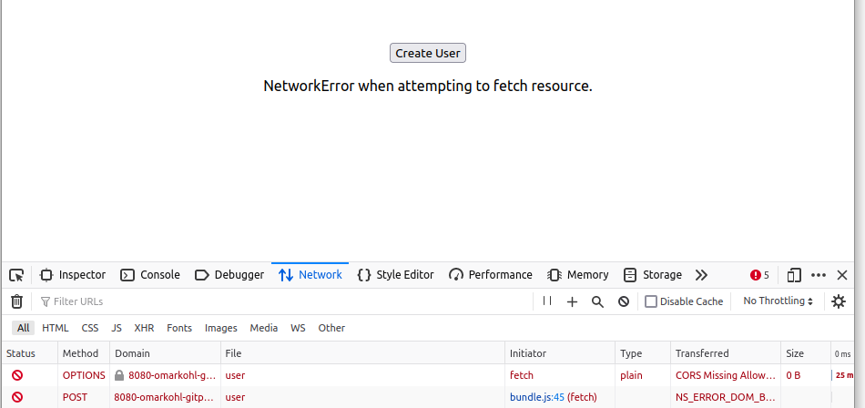
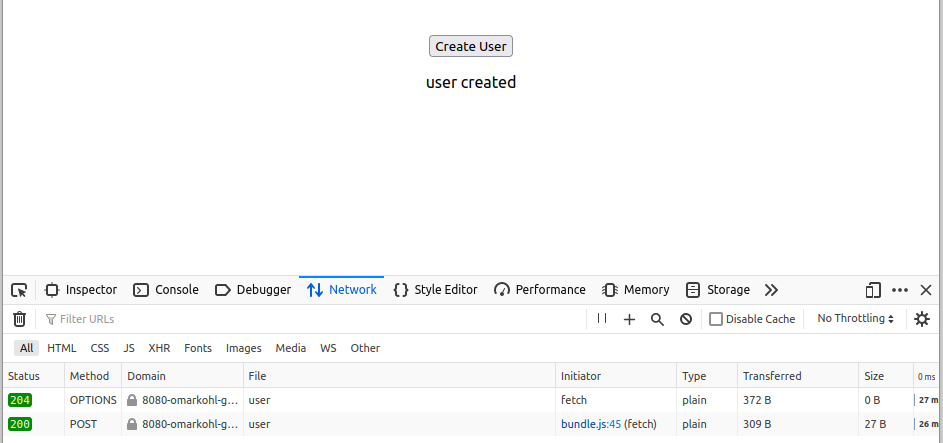

# GitHub Codespaces - CORS issue

Minimal example to debug CORS issues with GitHub Codespaces
https://github.com/orgs/community/discussions/15351 .


## GitHub Codespaces

A simple dev environment, directly in the browser.

TODO


## Code

Check `api/server.go` for the server code written in Go that allows CORS.

Check `gui/UserCreator.js` for the React frontend component that tries to 
create a new user via a POST request.

## Reproducing the issue

1. Start this environment in Gitpod.
2. Open the browser for the GUI (port 3000), which will open by default anyway.
3. Press the 'Create User' button and you will get an error.
4. In Gitpod make the API port **public** instead of private.
6. Press the 'Create User' button in the GUI again and you will get a success
   message.

You can see more details about the requests in the browser development tools.

Also check the API console window in Gitpod and you will see that no log
messages are shown in the error case because the requests never reach the API
but are blocked by Gitpod. Note in particular that the "Preflight request" 
is not being logged by the API! This is what leads me to suspect that Gitpod 
is blocking the request because it lacks authentication information, but the 
CORS spec is clear on the subject. Preflight OPTIONS requests must not 
include authentication information and web browsers will not do this!

> Preflight requests and credentials
> 
> CORS-preflight requests must never include credentials. The response to a 
> preflight request must specify Access-Control-Allow-Credentials: true to 
> indicate that the actual request can be made with credentials.

https://developer.mozilla.org/en-US/docs/Web/HTTP/CORS#requests_with_credentials


### Error case

Browser screenshot



API console output (empty):
```
...
```


### Success case

Browser screenshot



API console output:

```
[cors] 2022/11/10 11:32:22 Handler: Preflight request
[cors] 2022/11/10 11:32:22   Preflight response headers: map[Access-Control-Allow-Credentials:[true] Access-Control-Allow-Headers:[Content-Type] Access-Control-Allow-Methods:[POST] Access-Control-Allow-Origin:[https://3000-omarkohl-gitpodcors-l2wj2lg55co.ws-eu74.gitpod.io] Vary:[Origin Access-Control-Request-Method Access-Control-Request-Headers]]
[cors] 2022/11/10 11:32:22 Handler: Actual request
[cors] 2022/11/10 11:32:22   Actual response added headers: map[Access-Control-Allow-Credentials:[true] Access-Control-Allow-Origin:[https://3000-omarkohl-gitpodcors-l2wj2lg55co.ws-eu74.gitpod.io] Vary:[Origin]]
{"user":{"name":"Tom","age":23}}
2022/11/10 11:32:22 "POST http://8080-omarkohl-gitpodcors-l2wj2lg55co.ws-eu74.gitpod.io/api/user HTTP/1.1" from 192.168.162.135:46600 - 200 27B in 45.43µs
```
